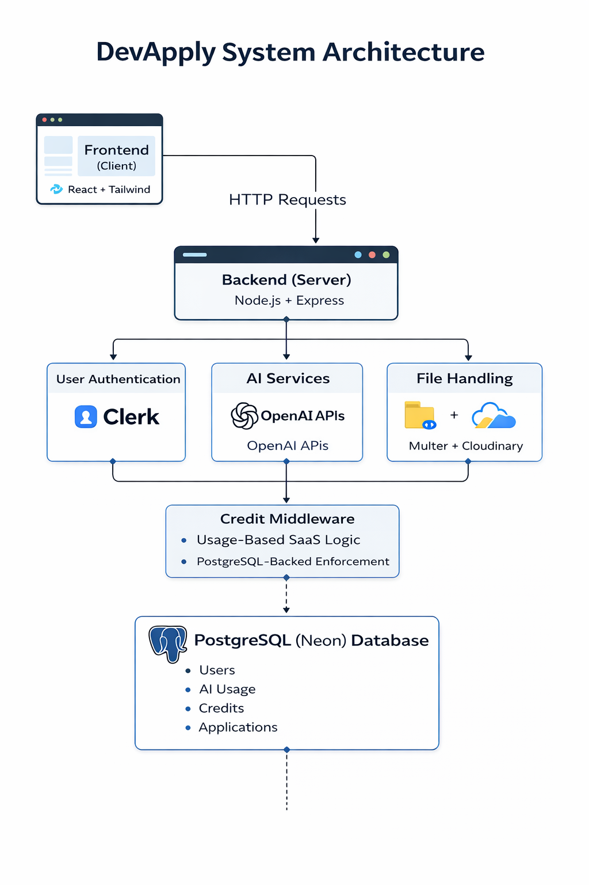

# DevApply 🚀  
### AI-Powered Career Assistant for Developers

DevApply is a production-style AI SaaS platform designed to help developers optimize resumes, generate job-specific applications, and evaluate job fit using AI-driven workflows.

The platform combines modern backend architecture, usage-based monetization logic, secure authentication, and AI integrations to simulate a real-world startup product.

---

## 🧠 What DevApply Does

DevApply enables developers to:

✅ Analyze resumes for strengths, gaps, and ATS improvements  
✅ Generate job-specific cover letters  
✅ Convert projects into resume-ready bullet points  
✅ Evaluate profile-to-JD compatibility  
✅ Track AI usage via a credit-based SaaS system  

---

## ✨ Core Features

### 🎯 AI-Powered Features

- **Resume Analyzer**  
  Upload PDF resumes and receive structured feedback, improvement hints, and ATS insights.

- **Cover Letter Generator**  
  Generate job-specific cover letters based on JD input.

- **Project Bullet Generator**  
  Convert GitHub/project descriptions into professional resume bullets.

- **Job Fit Analyzer**  
  Evaluate how well a profile matches a job description.

---

### 🧩 SaaS / Platform Features

- ✅ Usage-based AI credit system  
- ✅ Middleware-driven credit enforcement  
- ✅ Role-Based Access Control (USER / ADMIN)  
- ✅ Plan-based feature gating  
- ✅ Usage analytics dashboard  
- ✅ Secure authentication with Clerk  
- ✅ Scalable REST API architecture  

---

## 🏗️ System Architecture



DevApply follows a modern SaaS-style full-stack architecture:

Frontend → React + Tailwind  
Backend → Node.js + Express  
Database → PostgreSQL (Neon)  
Authentication → Clerk  
File Handling → Multer + Cloudinary  
AI Layer → OpenAI APIs  

---

## 🛠️ Tech Stack

**Frontend**
- React (Vite)
- Tailwind CSS

**Backend**
- Node.js
- Express.js

**Database**
- PostgreSQL (Neon)

**Authentication**
- Clerk

**Cloud / Storage**
- Cloudinary
- Multer

**AI Integration**
- OpenAI APIs

---

## 📁 Project Structure

### 🎨 Client (Frontend)

````

client/
├── public/
├── src/
│   ├── assets/
│   ├── components/
│   ├── pages/
│   │   ├── Community.jsx
│   │   ├── CoverLetterGenerator.jsx
│   │   ├── Dashboard.jsx
│   │   ├── Home.jsx
│   │   ├── JobFitAnalyzer.jsx
│   │   ├── Layout.jsx
│   │   ├── Pricing.jsx
│   │   ├── ProjectBulletGenerator.jsx
│   │   ├── ResumeAnalyzer.jsx
│   │   ├── Usage.jsx
│   ├── App.jsx
│   ├── main.jsx
│   ├── index.css
├── package.json
├── vite.config.js

```

---

### ⚙️ Server (Backend)

```

server/
├── configs/
│   ├── multer.js
│   ├── plans.js
│
├── controllers/
│   ├── activity.controller.js
│   ├── analytics.controller.js
│   ├── coverLetter.controller.js
│   ├── jobFit.controller.js
│   ├── projectBullets.controller.js
│   ├── resume.controller.js
│   ├── subscription.controller.js
│   ├── user.controller.js
│
├── db/
│   ├── index.js
│
├── middlewares/
│   ├── auth.middleware.js
│   ├── credits.middleware.js
│
├── routes/
│   ├── activity.routes.js
│   ├── analytics.routes.js
│   ├── coverLetter.routes.js
│   ├── jobFit.routes.js
│   ├── projectBullets.routes.js
│   ├── resume.routes.js
│   ├── subscription.routes.js
│   ├── user.routes.js
│
├── services/
│   ├── ai.service.js
│
├── utils/
│   ├── activityLogger.js
│   ├── creditRefresher.js
│   ├── credits.js
│   ├── pdfParser.js
│   ├── subscriptionGuard.js
│
├── server.js
├── package.json
├── .env

```

---

## 🧠 Credit System

DevApply implements a usage-based SaaS credit model.

✔ Middleware validates credits before AI execution  
✔ Credits deducted after successful responses  
✔ Usage logged in PostgreSQL  

Example Logic:

```

if (credits_remaining < featureCost) {
throw Error("Insufficient Credits");
}

````

---

## 📡 API Design

### 🎯 AI Routes
- POST /ai/resume/analyze  
- POST /ai/cover-letter/generate  
- POST /ai/project/describe  
- POST /ai/job-fit/analyze  

### 📊 Usage & Analytics
- GET /usage/summary  
- GET /analytics/dashboard  

---

## 🔐 Security Considerations

✅ Secure authentication via Clerk  
✅ Role-based access control  
✅ Middleware-protected routes  
✅ Credit enforcement layer  
✅ Environment-based configuration  

---

## 📸 Screenshots

| Feature | Preview |
|---------|---------|
| Landing Page |  |
| Dashboard |  |
| Resume Analyzer |  |
| Cover Letter Generator |  |
| Usage Analytics |  |

---

## 🚀 Getting Started

```bash
git clone https://github.com/AdityaBhosale22/devapply.git
cd devapply
````

### Install Dependencies

```bash
cd client && npm install
cd ../server && npm install
```

### Run Application

```bash
# Client
npm run dev

# Server
npm start
```

---

## 🔮 Future Improvements

* Payment Gateway Integration
* Advanced analytics
* Resume version tracking
* AI prompt optimization
* Multi-tenant SaaS support

---

## 👨‍💻 Author

**Aditya Bhosale**

GitHub: [https://github.com/AdityaBhosale22](https://github.com/AdityaBhosale22)

---

⭐ If you found this project interesting, consider starring the repo!

```
